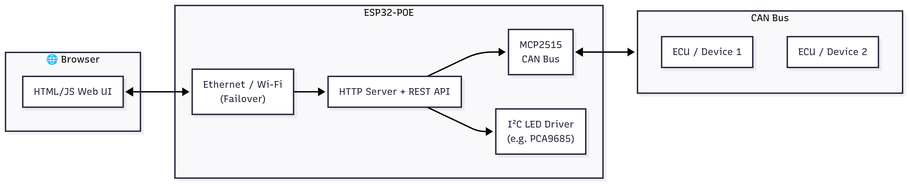

# ESP32-IDF-LED-CONTROLLER

ESP32-POE project using **ESP-IDF** that integrates:

- Ethernet + Wi-Fi failover networking  
- MCP2515 CAN bus controller  
- I²C devices (e.g. PCA9685 for LED dimming)  
- Embedded HTTP server serving an HTML UI from flash  
- REST-like API endpoints (`/api/...`) for configuration and control  

---

## 📂 Project Structure
ESP32-IDF-LED-CONTROLLER/
├── components/
│ ├── hsg_api/ # Custom API + HTML serving logic
│ ├── mcp2515/ # CAN bus driver for MCP2515
│ └── cJSON/ # JSON parsing
├── src/
│ └── main.cpp # Application entry point (app_main)
├── docs/
│ └── architecture.png # System architecture diagram
├── sdkconfig # ESP-IDF configuration
└── CMakeLists.txt

## 📡 System Architecture

The ESP32-POE acts as a central controller, bridging Ethernet/Wi-Fi, CAN bus, and I²C-driven LEDs.



---

## 🌐 Networking
- By default the ESP32-POE uses **Ethernet** if a cable is connected.  
- If Ethernet is not available, it falls back to **Wi-Fi** (configured via `sdkconfig`).  
- Logs show which interface is active and the assigned IP.

---

## 💡 Embedded HTML
The web UI (`ESP32-POE.html`) is embedded directly into flash using:

```cmake
# components/hsg_api/CMakeLists.txt
target_add_binary_data(${COMPONENT_TARGET} ESP32-POE.html TEXT)


ESP-IDF converts the file into linker symbols:

extern const uint8_t _binary_ESP32_POE_html_start[] asm("_binary_ESP32_POE_html_start");
extern const uint8_t _binary_ESP32_POE_html_end[]   asm("_binary_ESP32_POE_html_end");


At runtime, the / handler responds with the embedded HTML page:

static esp_err_t h_root(httpd_req_t *req) {
    const size_t html_size = _binary_ESP32_POE_html_end - _binary_ESP32_POE_html_start;
    httpd_resp_set_type(req, "text/html");
    return httpd_resp_send(req, (const char *)_binary_ESP32_POE_html_start, html_size);
}

So no SD card, SPIFFS, or external storage is needed — the UI is built into the firmware.

🔌 API Endpoints

The API is handled inside the hsg_api component. Examples:

GET /api/config → returns configuration JSON

POST /api/config → update configuration

GET /api/mqtt / POST /api/mqtt → manage MQTT settings

POST /api/command → execute a control command

GET /api/can/last → fetch last CAN frame received

POST /api/ota → handle firmware updates

🛠️ Build & Flash
Prerequisites

ESP-IDF v5.4
 installed and exported

ESP32-POE board connected via USB


Commands
idf.py set-target esp32
idf.py build
idf.py -p COM3 flash monitor   # replace COM3 with your serial port

🔍 Example Logs
I (3321) MAIN: ETH IP: 192.168.1.162
I (3321) HSG-API: API URIs registered
I (3321) HSG-API: HTTP API ready on :80
I (3331) MAIN: MCP2515 ready


