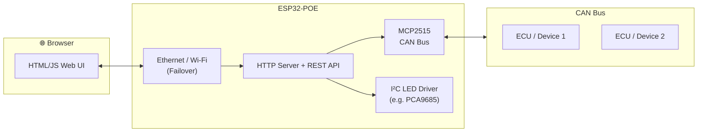

# ESP32-IDF-LED-CONTROLLER

An ESP-IDF project for the **Olimex ESP32-POE** board, integrating:

- ✅ **Ethernet & Wi-Fi failover** networking  
- ✅ **HTTP server with REST API**  
- ✅ **HTML web interface** (embedded in firmware)  
- ✅ **CAN bus** support via MCP2515  
- ✅ **I²C LED control** (e.g., PCA9685 PWM driver)

---

## 📡 System Architecture


```mermaid
flowchart LR
    subgraph Browser["🌐 Browser"]
        UI["HTML/JS Web UI"]
    end

    subgraph ESP32["ESP32-POE"]
        NET["Ethernet / Wi-Fi<br>(Failover)"]
        API["HTTP Server + REST API"]
        CAN["MCP2515<br>CAN Bus"]
        I2C["I²C LED Driver<br>(e.g. PCA9685)"]
    end

    UI <--> NET
    NET --> API
    API --> CAN
    API --> I2C

    subgraph CANBUS["CAN Bus"]
        ECU1["ECU / Device 1"]
        ECU2["ECU / Device 2"]
    end

    CAN <--> CANBUS
```
🛠️ Build Instructions

Prerequisites
ESP-IDF v5.4

Olimex ESP32-POE hardware

Git + CMake + Ninja build tools

Clone Repository
bash
git clone https://github.com/hughkojack/ESP32-IDF-LED-CONTROLLER.git
cd ESP32-IDF-LED-CONTROLLER
idf.py set-target esp32

Build & Flash
bash

idf.py build
idf.py flash -p COMx   # replace COMx with your serial port
idf.py monitor

🌐 Web Interface
The HTML/JS frontend (ESP32-POE.html) is embedded into flash at build time.

This is done via the component CMakeLists:

cmake
target_add_binary_data(${COMPONENT_TARGET} ESP32-POE.html TEXT)

At runtime, the root URI / serves the embedded page.

The page interacts with the ESP32 through REST API endpoints (e.g., /api/config, /api/command).

🔌 API Endpoints
Endpoint	Method	Description
/api/adopt	GET	Adoption test endpoint
/api/config	GET	Fetch configuration JSON
/api/config	POST	Update configuration
/api/mqtt	GET	Get MQTT settings
/api/mqtt	POST	Update MQTT settings
/api/command	POST	Execute command
/api/can/last	GET	Get last received CAN frame
/api/ota	POST	Perform OTA update
/	GET	Serve HTML/JS web UI (from flash)

## 📂 Repository Structure

```
ESP32-IDF-LED-CONTROLLER/
├── components/
│   ├── hsg_api/          # API + embedded web UI
│   ├── hsg_panel/        # Olimex LCD + encoder commissioning UI
│   ├── hsg_outputs/      # PCA9685 mapping / PWM
│   ├── esp32-mcp2515/    # CAN bus driver
│   └── cJSON/            # JSON support
├── docs/                 # Protocol and feature docs
├── src/
│   ├── main.cpp          # Main application logic
│   └── hardware_config.h # Board pin maps (incl. panel)
├── README.md
├── CMakeLists.txt
└── platformio.ini
```

### Notes
- ⚡ The ESP32 will **prefer Ethernet** if connected, and fall back to **Wi-Fi** otherwise.  
- 🚌 CAN bus is handled through MCP2515 over SPI with **interrupt-driven reception**.  
- 💡 I²C is available for LED control (e.g., via PCA9685) but can be extended for other peripherals.  


## Web Interface

The firmware provides two web pages for interacting with the device, served on port 80.

### Configuration Interface (`/`)

The main interface, accessed by navigating to the device's IP address, is used for all device configuration. This includes:
- I2C Device Mapping
- Output Labels
- Group Definitions
- CAN Switch Bindings
- Network & MQTT Settings
- Advanced → **Global Settings** (default brightness, group stagger)
- Advanced actions like OTA updates and restarts.

#### Global Settings

Under **Advanced → Global Settings**:

| Setting | Config key | Description |
|---------|------------|-------------|
| Default Brightness | `config.settings.defaultBrightness` | 1–100% (default **50**). Used when a lighting command does not specify brightness. |
| Group Stagger Delay | `config.settings.groupStaggerMs` | Delay between channels when a group has stagger enabled. |

Brightness resolution for `ON` / `TOGGLE` (when turning on):

1. Explicit `brightness` in the command / binding / MQTT JSON wins.
2. Otherwise the hub uses `settings.defaultBrightness`.
3. `OFF` / toggle-off always forces 0.

The Olimex local LCD panel toggle also uses the global default (it does not restore the last per-channel level).

See [docs/CONFIG_AND_BRIGHTNESS.md](docs/CONFIG_AND_BRIGHTNESS.md).

### Real-Time Control Interface (`/control`)

Introduction of control.html
The control.html file provides a dedicated, user-friendly interface for real-time control of the lighting system, separate from the main configuration page. It is designed to be a simple, responsive "remote control" that can be used from a phone, tablet, or desktop.

Key Features:
1. Dynamic UI Generation: The page is built dynamically based on the Hub's current configuration. It fetches the groups, i2c mappings, and labels from the /api/config endpoint and creates an organized, collapsible accordion layout. Each section represents a group, and inside, it lists all the individual lights belonging to that group with their custom names.

2. Real-Time, Bi-Directional Feedback: The page immediately establishes a WebSocket connection to the ESP32 Hub.

- ESP32 to Browser: Whenever a light's state changes—regardless of whether the command came from a physical CAN switch, an MQTT message, or the web UI itself—the Hub broadcasts a status update over the WebSocket. The JavaScript on the page receives this message and instantly updates the corresponding button and slider to reflect the true state of the physical light.

- Browser to ESP32: User interactions on the page (clicking a button or moving a slider) send commands to the /api/command endpoint to control the lights.

3. Comprehensive Control: The interface provides control over both groups and individual lights:

- Group Control: Each accordion section has a master "All" button to toggle the entire group on or off.

- Individual Control: Inside each group, every light has its own power toggle icon, a descriptive label, and a "glowing track" slider for fine-grained brightness control (0-100%).

This implementation creates a seamless and intuitive user experience, ensuring the web interface is always a perfect, real-time mirror of the lighting system's actual state.

### Local Commissioning Panel (Olimex ESP32-POE)

On **Olimex ESP32-POE** builds, an optional ST7789 LCD + EC11 encoder panel (`components/hsg_panel`) provides on-device commissioning:

- Browse mapped PCA outputs and toggle channels (uses **Default Brightness** when turning on)
- Live refresh of output on/off state while the Outputs page is open
- View network status and discovered CAN nodes

Pins and SPI host are defined in `src/hardware_config.h` (`PANEL_*`). See [docs/COMMISSIONING_PANEL.md](docs/COMMISSIONING_PANEL.md).

## 📡 CAN Protocol

The LED Controller communicates with wall switch nodes using a structured 11-bit CAN protocol.
## 🏗 System Architecture
Wall Switch Nodes → CAN Bus → LED Controller Hub → LED Outputs

👉 Full protocol documentation:
[CAN Protocol Specification](docs/CAN_PROTOCOL.md)
