# ESP32-IDF-LED-CONTROLLER

An ESP-IDF project for the **Olimex ESP32-POE** board, integrating:

- ✅ **Ethernet & Wi-Fi failover** networking  
- ✅ **HTTP server with REST API**  
- ✅ **HTML web interface** (embedded in firmware)  
- ✅ **CAN bus** support via MCP2515  
- ✅ **I²C LED control** (e.g., PCA9685 PWM driver)

---

## 📡 System Architecture

```mermaid
flowchart LR
    subgraph Browser["🌐 Browser"]
        UI["HTML/JS Web UI"]
    end

    subgraph ESP32["ESP32-POE"]
        NET["Ethernet / Wi-Fi<br>(Failover)"]
        API["HTTP Server + REST API"]
        CAN["MCP2515<br>CAN Bus"]
        I2C["I²C LED Driver<br>(e.g. PCA9685)"]
    end

    UI <--> NET
    NET --> API
    API --> CAN
    API --> I2C

    subgraph CANBUS["CAN Bus"]
        ECU1["ECU / Device 1"]
        ECU2["ECU / Device 2"]
    end

    CAN <--> CANBUS
```

🛠️ Build Instructions
Prerequisites
ESP-IDF v5.4

Olimex ESP32-POE hardware

Git + CMake + Ninja build tools

Clone Repository
bash
git clone https://github.com/hughkojack/ESP32-IDF-LED-CONTROLLER.git
cd ESP32-IDF-LED-CONTROLLER
idf.py set-target esp32

Build & Flash
bash

idf.py build
idf.py flash -p COMx   # replace COMx with your serial port
idf.py monitor

🌐 Web Interface
The HTML/JS frontend (ESP32-POE.html) is embedded into flash at build time.

This is done via the component CMakeLists:

cmake
target_add_binary_data(${COMPONENT_TARGET} ESP32-POE.html TEXT)

At runtime, the root URI / serves the embedded page.

The page interacts with the ESP32 through REST API endpoints (e.g., /api/config, /api/command).

🔌 API Endpoints
Endpoint	Method	Description
/api/adopt	GET	Adoption test endpoint
/api/config	GET	Fetch configuration JSON
/api/config	POST	Update configuration
/api/mqtt	GET	Get MQTT settings
/api/mqtt	POST	Update MQTT settings
/api/command	POST	Execute command
/api/can/last	GET	Get last received CAN frame
/api/ota	POST	Perform OTA update
/	GET	Serve HTML/JS web UI (from flash)

📂 Repository Structure
bash

ESP32-IDF-LED-CONTROLLER/
├── components/
│   ├── hsg_api/          # API + web server logic
│   ├── mcp2515/          # CAN bus driver
│   └── cJSON/            # JSON support
├── src/
│   └── main.cpp          # Main application logic
├── ESP32-POE.html        # Web interface (embedded)
├── README.md             # This file
└── CMakeLists.txt
⚡ Notes
The ESP32 will prefer Ethernet if connected, and fall back to Wi-Fi otherwise.

CAN bus is handled through MCP2515 over SPI with interrupt-driven reception.

I²C is available for LED control (e.g., via PCA9685) but can be extended for other peripherals.

